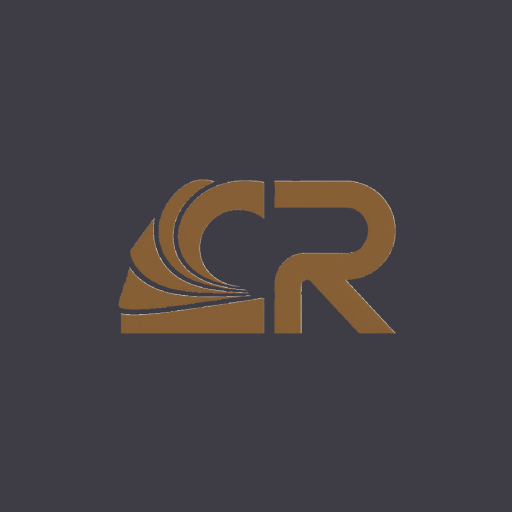

# ClipReader 

 

**Уставай меньше, запоминай больше с научным методом RSVP!**

ClipReader — это инновационное Android-приложение, которое реализует уникальный формат чтения книг по словам (RSVP). Этот метод, называемый Rapid Serial Visual Presentation (RSVP), позволяет читать быстрее и с меньшим напряжением глаз. В отличие от аналогичных решений, данное приложение имеет под собой научный фундамент, что позволяет раскрыть метод чтения RSVP на все 100%.

## 📱 Скачать

**Загрузите последнюю версию ClipReader из [RuStore](https://www.rustore.ru/catalog/app/com.clipreader)**

## 🚀 Возможности

- **Технология RSVP**: Продвинутая система презентации текста по словам
- **Научная основа**: Построено на проверенных исследовательских методологиях для оптимальной эффективности чтения
- **Снижение усталости глаз**: Минимизирует зрительное напряжение во время длительного чтения
- **Повышение скорости**: Значительно увеличивает скорость чтения при сохранении понимания
- **Оптимизация для Android**: Производительность, адаптированная для мобильного чтения

## 🧠 Что такое RSVP?

Rapid Serial Visual Presentation (RSVP) — это научно обоснованный метод, который представляет текст по одному слову за раз в фиксированном месте на экране. Данная техника:

- **Исключает движение глаз** по странице
- **Снижает когнитивную нагрузку** за счет фокусировки внимания на отдельных словах
- **Заставляет мозг сфокусироваться** на чтении и не отвлекаться на посторонние элементы
- **Увеличивает скорость чтения** без ущерба для понимания
- **Минимизирует зрительную усталость** по сравнению с традиционными методами чтения

## 🔬 Научный подход

В отличие от других приложений для чтения, ClipReader построен на прочном научном фундаменте, который позволяет методу чтения RSVP достичь своего полного 100% потенциала. Моя реализация основана на:

- Исследованиях когнитивной психологии
- Изучении визуального восприятия
- Оптимизации понимания прочитанного
- Исследованиях отслеживания взгляда и внимания

## 🛠️ Технологический стек

- **React Native** — Кроссплатформенная мобильная разработка
- **JavaScript** — Основной язык разработки
- **Firebase Backend** — Облачная база данных и аутентификация
- **Реализация научных алгоритмов** — Логика времени и презентации RSVP

## 🤝 Участие в разработке

Хотите помочь с разработкой ClipReader? 

Напишите мне в Telegram: [@MeLkiY_MeTa_LiST](https://t.me/MeLkiY_MeTa_LiST)

Я буду рад обсудить с вами:
- Новые функции и улучшения
- Исправление багов
- Оптимизацию производительности
- Любые идеи по развитию проекта

## 📞 Контакты

По вопросам, предложениям или поддержке, пожалуйста, создайте issue в этом репозитории.

---

**Преобразите свой опыт чтения с помощью технологии скорочтения, основанной на науке!** 🚀📖 
